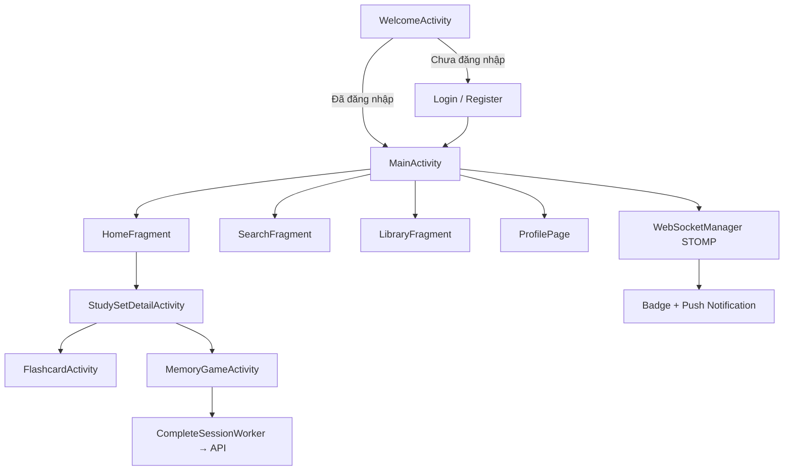

# Mosquizto

Ứng dụng Android học từ vựng / flashcard theo mô hình tương tự Quizlet. Người dùng có thể tạo bộ thẻ, học qua flashcard, chơi mini-game (trắc nghiệm, điền khuyết, ghép cặp), tìm kiếm bộ thẻ công khai, quản lý thư viện/folder, chia sẻ bộ thẻ và nhận thông báo thời gian thực.

---

## Đánh giá tổng quan

| Tiêu chí | Nhận xét |
|----------|----------|
| **Phạm vi tính năng** | Rộng cho một dự án học tập: auth, CRUD collection, học tập đa chế độ, tìm kiếm, gợi ý, folder, báo cáo, mời chia sẻ, notification real-time |
| **Mức độ hoàn thiện** | MVP+ — luồng chính hoạt động, một số màn hình/ tính năng còn placeholder (`msg_dev_mode`) |
| **Chất lượng code** | Trung bình khá: có DI, ViewModel, tách layer API/DTO rõ; vẫn còn Activity “God class”, code legacy và thiếu test |
| **Khả năng mở rộng** | Tốt nhờ Hilt + Retrofit interface; cần chuẩn hóa config và giảm logic UI trong Activity |
| **Sẵn sàng production** | Chưa — hardcode URL dev, cleartext HTTP, chưa minify release, gần như không có automated test |

**Quy mô codebase:** ~119 file Java, ~290 resource (layout, drawable, strings), 1 module `app`.

---

## Tính năng chính

### Xác thực & tài khoản
- Đăng nhập, đăng ký, quên mật khẩu
- Lưu session (access token, refresh token, user) qua `SharedPreferences`
- Màn hình Welcome là launcher, điều hướng theo trạng thái đăng nhập

### Học tập
- **Flashcard:** lật thẻ, vuốt trái/phải, shuffle, auto-play, đếm Known/Learning
- **Memory Game / Learn mode:** nhiều chế độ (`LEARN`, `TEST`, `ONLY_MCQ`, `ONLY_FB`, `ONLY_MATCH`)
  - Trắc nghiệm (MCQ)
  - Điền khuyết (Fill-in-the-blank)
  - Ghép cặp (Matching)
- Ghi nhận phiên học (`study-session`), gửi kết quả batch lên server qua `WorkManager` (`CompleteSessionWorker`) khi mất mạng / thoát app

### Quản lý nội dung
- Tạo / sửa / xóa collection và từng thẻ (term/definition)
- Thư viện cá nhân, folder, starred items
- Bộ thẻ mở gần đây, Jump back in, gợi ý collection

### Khám phá & cộng đồng
- Tìm kiếm collection (theo từ khóa, tác giả, phân trang)
- Chia sẻ bộ thẻ, chấp nhận/từ chối lời mời
- Báo cáo nội dung vi phạm, xử lý report (owner)

### Thông báo real-time
- WebSocket STOMP (`/user/queue/notifications`)
- Badge trên bottom nav, push notification hệ thống, màn `NotificationActivity`
- Snackbar reload khi có thông báo mới

### UX khác
- Dark mode (`ThemeManager`)
- Đa ngôn ngữ: `values/` (EN) và `values-vi/` (VI)
- Bottom navigation: Home, Search, Create, Library, Profile

---

## Kiến trúc & stack kỹ thuật

### Stack

| Thành phần | Công nghệ |
|------------|-----------|
| Ngôn ngữ | Java (100% logic app) |
| UI | XML Layout + ViewBinding, Material Components |
| DI | Dagger Hilt (KSP) |
| Networking | Retrofit 2.9 + OkHttp + Gson |
| Real-time | STOMP over WebSocket (`StompProtocolAndroid`) |
| Async UI state | LiveData + ViewModel |
| Background work | WorkManager + HiltWorker |
| Event bus | GreenRobot EventBus (login success, v.v.) |
| Image | Glide, CircleImageView |
| Build | Gradle Kotlin DSL, `compileSdk 36`, `minSdk 27`, `targetSdk 34` |

> Lưu ý: `build.gradle.kts` bật Jetpack Compose nhưng toàn bộ UI hiện tại dùng XML — Compose chưa được áp dụng thực tế.

### Kiến trúc tổng thể

```
┌─────────────────────────────────────────────────────────┐
│  Activities / Fragments / Dialogs / Adapters (UI)      │
├─────────────────────────────────────────────────────────┤
│  ViewModels (Home, Search, Login, Notification, …)      │
├─────────────────────────────────────────────────────────┤
│  Services: SessionManager, AuthInterceptor, Workers     │
│  Network: WebSocketManager, Retrofit API interfaces     │
├─────────────────────────────────────────────────────────┤
│  DTO (request/response) · Models · Util                 │
└─────────────────────────────────────────────────────────┘
         │ REST (Bearer JWT)          │ STOMP + Bearer
         ▼                            ▼
              Backend (Spring Boot — port 8080)
```

### Luồng dữ liệu điển hình

1. **API call:** Activity/Fragment → ViewModel → Retrofit `*Api` → `AuthInterceptor` gắn `Authorization: Bearer <token>` → Gson parse `ApiResponse<T>`
2. **Session:** `SessionManager` (Singleton, Hilt) đọc/ghi `SharedPreferences`
3. **Học tập:** `MemoryGameActivity` start session → thu thập `StudySessionDetailRequest` → `CompleteSessionWorker` retry khi lỗi mạng/5xx
4. **Notification:** Login/Main → `MainViewModel.connectStomp()` → `WebSocketManager` → LiveData cập nhật badge + system notification

### Cấu trúc package

```
com.example.mosquizto/
├── Activities/      # Màn hình full-screen
├── Fragments/       # Home, Search, Library (ViewPager), Settings
├── ViewModels/      # Logic + LiveData
├── Network/
│   ├── itf/         # UserApi, CollectionApi, StudyApi, FolderApi, NotificationApi
│   └── WebSocketManager.java
├── Modules/         # Hilt NetworkModule
├── Services/        # SessionManager, AuthInterceptor, CompleteSessionWorker
├── Dto/             # request/response
├── Models/          # Domain model UI
├── Adapters/        # RecyclerView
├── Dialogs/         # Bottom sheet, dialog
├── Util/            # Enum, ThemeManager, wrapper
└── Event/           # EventBus events
```

### API Backend (REST)

Base URL mặc định (emulator): `http://10.0.2.2:8080/`

| Nhóm | Endpoint ví dụ |
|------|----------------|
| User | login, register, profile |
| Collection | CRUD, search, recent, recommend, share, report |
| Study | `study-session/start`, `complete-batch`, jump-back-in |
| Folder | quản lý folder |
| Notification | danh sách, đánh dấu đọc |

WebSocket: `ws://10.0.2.2:8080` + endpoint trong `strings.xml` (`ws_endpoint`).

---

## Hướng dẫn triển khai

### Yêu cầu

- Android Studio (Ladybug trở lên khuyến nghị)
- JDK 11+
- Backend Mosquizto chạy tại port **8080** (Spring Boot hoặc tương đương)

### Chạy trên emulator

1. Clone repository và mở bằng Android Studio
2. Backend chạy trên máy host — emulator dùng `10.0.2.2` để trỏ về localhost
3. Sync Gradle → Run `app`

URL đã cấu hình sẵn trong:
- `NetworkModule.java` → `baseUrl("http://10.0.2.2:8080/")`
- `res/values/strings.xml` → `ws_base_url`

### Chạy trên thiết bị thật

1. Đổi `baseUrl` trong `NetworkModule` và `ws_base_url` sang IP LAN của máy chạy backend (vd: `http://192.168.1.x:8080/`)
2. Đảm bảo `android:usesCleartextTraffic="true"` trong `AndroidManifest` (hiện đang bật cho dev)
3. Thiết bị và máy backend cùng mạng Wi‑Fi

### Build release

```bash
./gradlew assembleRelease
```

Hiện `isMinifyEnabled = false` — APK release chưa được tối ưu/obfuscate.

### Cấu hình nên tách ra (khuyến nghị)

| Biến | Vị trí hiện tại |
|------|-----------------|
| REST base URL | `NetworkModule.java` |
| WebSocket URL | `res/values/strings.xml` |
| Cleartext | `AndroidManifest.xml` |

Nên chuyển sang `buildConfigField` / product flavors (`debug` / `staging` / `release`) và HTTPS cho production.

---

## Điểm mạnh

1. **Phạm vi tính năng phong phú** — không chỉ flashcard đơn giản mà có game học đa dạng, recommendation, social (share/invite/report), session tracking.

2. **Kiến trúc có hướng modern Android** — Hilt DI, ViewModel + LiveData, tách Retrofit interface theo domain (`UserApi`, `CollectionApi`, …), DTO request/response rõ ràng.

3. **Xử lý offline/retry cho phiên học** — `CompleteSessionWorker` với retry khi lỗi server/mạng là thiết kế thực tế, tránh mất dữ liệu học tập.

4. **Real-time notification hoàn chỉnh** — STOMP lifecycle, badge count persist qua SharedPreferences, system notification channel, map unread theo `type_referenceId`.

5. **UX được đầu tư** — dark mode, đa ngôn ngữ VI/EN, bottom nav, swipe flashcard, nhiều layout Material.

6. **API design phía client linh hoạt** — phân trang search/recommend, idempotency key khi start session, batch complete thay vì từng request.

7. **Nhất quán package structure** — dễ onboard: Activities/Fragments/ViewModels/Adapters tách bạch.

---

## Điểm yếu & rủi ro

1. **Hardcode môi trường dev**
   - URL `10.0.2.2:8080` cố định trong code và strings
   - `usesCleartextTraffic=true` — không phù hợp production
   - Không có product flavors / BuildConfig

2. **Thiếu test tự động**
   - Chỉ có `ExampleUnitTest` và `ExampleInstrumentedTest` mặc định
   - Không test ViewModel, Worker, API parsing, WebSocket logic

3. **Activity quá lớn, logic UI lẫn business**
   - `MemoryGameActivity` ~700 dòng — khó bảo trì, khó test
   - Một số Activity gọi Retrofit trực tiếp thay vì qua ViewModel

4. **Code legacy / trùng lặp**
   - `RetrofitClient` singleton không còn được sử dụng (đã thay bằng Hilt `NetworkModule`)
   - `MainActivity` vẫn import STOMP nhưng kết nối thực tế qua `WebSocketManager`
   - Compose được khai báo dependency nhưng không dùng → tăng build size không cần thiết

5. **Auth chưa hoàn chỉnh**
   - Lưu `refreshToken` nhưng `AuthInterceptor` không tự refresh khi 401
   - `SessionManager.isLoginExpired()` có công thức nghi vấn (`* 1000` sau khi trừ timestamp)
   - Không có interceptor xử lý token hết hạn tập trung

6. **Lifecycle WebSocket**
   - `MainViewModel.onCleared()` gọi `disconnect()` — có thể ngắt kết nối không mong muốn khi xoay màn hình / recreate Activity nếu ViewModel bị clear

7. **Bảo mật & release**
   - `isMinifyEnabled = false` — không ProGuard/R8 cho release
   - Token lưu plain text trong SharedPreferences (nên dùng EncryptedSharedPreferences)

8. **Chất lượng API contract**
   - `StudyApi.completeStudySession` có query param `isFullTest ` (dấu cách thừa) — dễ gây lỗi tích hợp BE
   - `CollectionApi` có hai method `getMyCollections` trùng tên, khác signature — dễ nhầm lẫn

9. **Callback hell thay vì coroutines/Rx chuẩn**
   - Retrofit `Call.enqueue` rải rác; RxJava chỉ phục vụ STOMP library
   - Dự án có Kotlin plugin (Compose) nhưng không dùng Kotlin/coroutines

10. **Một số tính năng còn stub**
    - String `msg_dev_mode` — vẫn có màn hình/tính năng “đang phát triển”
    - Achievements, streak UI có layout nhưng logic có thể chưa đầy đủ

---

## Sơ đồ luồng người dùng (rút gọn)



---

## Hướng cải thiện đề xuất

| Ưu tiên | Hạng mục |
|---------|----------|
| Cao | Build flavors + HTTPS, EncryptedSharedPreferences, token refresh |
| Cao | Tách `MemoryGameActivity` → ViewModel + use case, giảm God Activity |
| Trung bình | Xóa dead code (`RetrofitClient`), bỏ Compose nếu không dùng |
| Trung bình | Unit test ViewModel, Worker; integration test API |
| Thấp | Migrate dần sang Kotlin + Coroutines + Flow |
| Thấp | Bật R8/minify cho release, CI (GitHub Actions) |

---

## License

Chưa khai báo — bổ sung khi publish/open source.

## Liên hệ / Repository

GitHub: [Dat-se40/Mosquizto](https://github.com/Dat-se40/Mosquizto)
