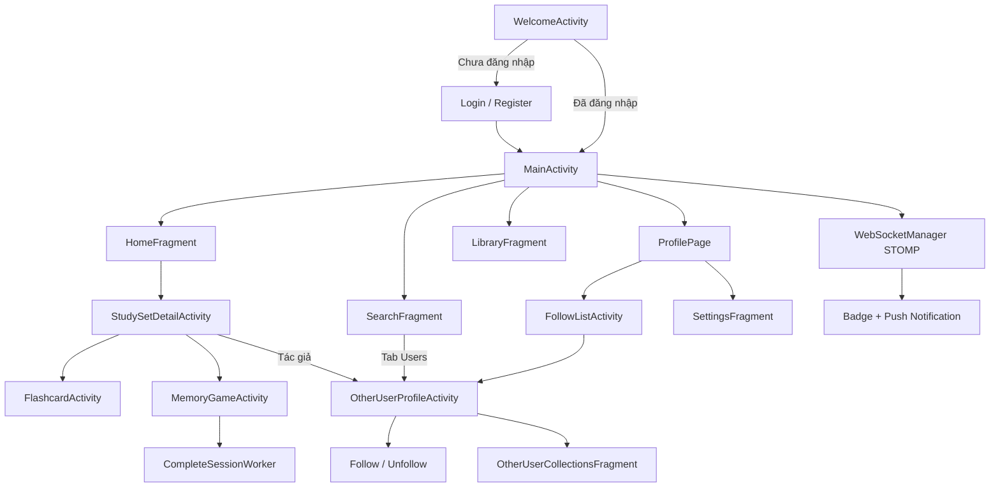

# Mosquizto

Ứng dụng Android học từ vựng / flashcard theo mô hình tương tự Quizlet. Người dùng có thể tạo bộ thẻ, học qua flashcard và mini-game, khám phá nội dung cộng đồng, kết nối với người dùng khác qua hệ thống follow, và nhận thông báo thời gian thực.

**Quy mô codebase:** ~124 file Java, 1 module `app`.

---

## Tính năng chính

### Xác thực & tài khoản
- Đăng nhập, đăng ký, quên mật khẩu
- Lưu session (access token, refresh token, user) qua `SharedPreferences`
- Màn hình Welcome là launcher, điều hướng theo trạng thái đăng nhập
- Cài đặt tài khoản: username, email, dark mode, push notification

### Học tập
- **Flashcard:** lật thẻ, vuốt trái/phải, shuffle, auto-play, đếm Known/Learning
- **Memory Game / Learn mode:** nhiều chế độ (`LEARN`, `TEST`, `ONLY_MCQ`, `ONLY_FB`, `ONLY_MATCH`)
  - Trắc nghiệm (MCQ)
  - Điền khuyết (Fill-in-the-blank)
  - Ghép cặp (Matching)
- Ghi nhận phiên học (`study-session`), gửi kết quả batch lên server qua `WorkManager` (`CompleteSessionWorker`) khi mất mạng / thoát app
- **Study streak:** thống kê chuỗi ngày học, phiên học (`AchievementActivity`)

### Quản lý nội dung
- Tạo / sửa / xóa collection và từng thẻ (term/definition)
- Thư viện cá nhân, folder, starred items
- Bộ thẻ mở gần đây, Jump back in, gợi ý collection

### Khám phá & cộng đồng
- Tìm kiếm collection (theo từ khóa, tác giả, phân trang)
- Chia sẻ bộ thẻ, chấp nhận/từ chối lời mời
- Báo cáo nội dung vi phạm, xử lý report (owner)

### Mạng người dùng (User Network)

Tính năng xã hội giúp người dùng khám phá tác giả và theo dõi hoạt động học tập của nhau.

| Tính năng | Mô tả |
|-----------|--------|
| **Tìm kiếm người dùng** | Tab *Users* trong `SearchFragment`, gọi `GET user/search` với debounce |
| **Hồ sơ cá nhân** | `ProfilePage` — xem thông tin, số followers/following, streak |
| **Hồ sơ người khác** | `OtherUserProfileActivity` — xem profile, danh sách bộ thẻ công khai |
| **Follow / Unfollow** | Nút Follow trên hồ sơ người khác, optimistic UI + rollback khi API lỗi |
| **Danh sách Follow** | `FollowListActivity` — tab *Following* / *Followers*, phân trang |
| **Bộ thẻ của người khác** | `OtherUserCollectionsFragment` — xem và mở study set từ profile |
| **Tùy chọn người dùng** | Bottom sheet: ẩn người dùng, báo cáo vi phạm |
| **Điều hướng xã hội** | Từ kết quả tìm kiếm, study set detail (tác giả) → hồ sơ người dùng |

Luồng follow điển hình:

```
Search (Users) → OtherUserProfileActivity → Follow/Unfollow
ProfilePage → FollowListActivity → OtherUserProfileActivity / ProfilePage
StudySetDetail → OtherUserProfileActivity (tác giả)
```

### Thông báo real-time
- WebSocket STOMP qua `WebSocketManager`
- Topic: `/user/queue/invitation`, `/user/queue/report`
- Badge số thông báo, push notification hệ thống (có thể bật/tắt trong Settings)
- Màn `NotificationActivity` — lời mời, báo cáo collection

### UX & cài đặt
- Dark mode (`ThemeManager`)
- Đa ngôn ngữ: `values/` (EN) và `values-vi/` (VI)
- Bottom navigation: Home, Search, Create, Library, Profile
- About dialogs: Privacy Policy, Terms of Service, Open Source Licenses, Help Center

---

## Kiến trúc & stack kỹ thuật

### Stack

| Thành phần | Công nghệ |
|------------|-----------|
| Ngôn ngữ | Java |
| UI | XML Layout + ViewBinding, Material Components |
| DI | Dagger Hilt (KSP) |
| Networking | Retrofit 2.9 + OkHttp + Gson |
| Real-time | STOMP over WebSocket (`StompProtocolAndroid`) |
| Async UI state | LiveData + ViewModel |
| Background work | WorkManager + HiltWorker |
| Event bus | GreenRobot EventBus |
| Image | Glide, CircleImageView |
| Build | Gradle Kotlin DSL, AGP 9.0.1, `compileSdk 36`, `minSdk 27`, `targetSdk 34`, JDK 17 |

> AGP 9 dùng **built-in Kotlin** — không cần plugin `org.jetbrains.kotlin.android` riêng. Compose Compiler plugin được khai báo; UI chính vẫn dùng XML.

### Kiến trúc tổng thể

```
┌─────────────────────────────────────────────────────────┐
│  Activities / Fragments / Dialogs / Adapters (UI)      │
├─────────────────────────────────────────────────────────┤
│  ViewModels (Home, Search, Login, Notification, …)    │
├─────────────────────────────────────────────────────────┤
│  Services: SessionManager, AuthInterceptor, Workers     │
│  Network: WebSocketManager, Retrofit API interfaces     │
├─────────────────────────────────────────────────────────┤
│  DTO (request/response) · Models · Util                 │
└─────────────────────────────────────────────────────────┘
         │ REST (Bearer JWT)          │ STOMP + Bearer
         ▼                            ▼
              Backend (Spring Boot — port 8080)
```

### Luồng dữ liệu điển hình

1. **API call:** Activity/Fragment → ViewModel → Retrofit `*Api` → `AuthInterceptor` gắn `Authorization: Bearer <token>` → Gson parse `ApiResponse<T>`
2. **Session:** `SessionManager` (Singleton, Hilt) đọc/ghi `SharedPreferences`
3. **Học tập:** `MemoryGameActivity` start session → thu thập `StudySessionDetailRequest` → `CompleteSessionWorker` retry khi lỗi mạng/5xx
4. **Follow:** `OtherUserProfileActivity` → `UserApi.followUser` / `unfollowUser` → cập nhật UI optimistic
5. **Notification:** Login/Main → `MainViewModel.connectStomp()` → `WebSocketManager` → LiveData badge; push notification tuân theo cài đặt `pushNotificationsEnabled`

### Cấu trúc package

```
com.example.mosquizto/
├── Activities/      # Màn hình full-screen (Profile, FollowList, OtherUserProfile, …)
├── Fragments/       # Home, Search, Library, OtherUserCollections, Settings
├── ViewModels/      # Logic + LiveData
├── Network/
│   ├── itf/         # UserApi, CollectionApi, StudyApi, FolderApi
│   └── WebSocketManager.java
├── Modules/         # Hilt NetworkModule
├── Services/        # SessionManager, AuthInterceptor, CompleteSessionWorker
├── Dto/             # request/response
├── Models/          # Domain model UI
├── Adapters/        # RecyclerView
├── Dialogs/         # Bottom sheet, dialog
├── Util/            # Enum, ThemeManager, AboutDialogHelper
└── Event/           # EventBus events
```

### API Backend (REST)

Base URL mặc định (emulator): `http://10.0.2.2:8080/`

| Nhóm | Endpoint ví dụ |
|------|----------------|
| Auth | `auth/login`, `auth/register`, `auth/forgot-password`, `auth/logout` |
| User | `user/profile`, `user/profile/{username}`, `user/search`, `user/streak` |
| Follow | `user/follow/{username}`, `user/followers`, `user/following` |
| Collection | CRUD, search, recent, recommend, share, report |
| Study | `study-session/start`, `complete-batch`, jump-back-in |
| Folder | quản lý folder |

WebSocket: `ws://10.0.2.2:8080` + `ws_endpoint` trong `res/values/strings.xml`.

---

## Hướng dẫn triển khai

### Yêu cầu

- Android Studio (Ladybug trở lên khuyến nghị)
- JDK 17+
- Backend Mosquizto chạy tại port **8080** (Spring Boot hoặc tương đương)

### Chạy trên emulator

1. Clone repository và mở bằng Android Studio
2. Backend chạy trên máy host — emulator dùng `10.0.2.2` để trỏ về localhost
3. Sync Gradle → Run `app`

URL đã cấu hình sẵn trong:
- `NetworkModule.java` → `baseUrl("http://10.0.2.2:8080/")`
- `res/values/strings.xml` → `ws_base_url`

### Chạy trên thiết bị thật

1. Đổi `baseUrl` trong `NetworkModule` và `ws_base_url` sang IP LAN của máy chạy backend (vd: `http://192.168.1.x:8080/`)
2. Đảm bảo `android:usesCleartextTraffic="true"` trong `AndroidManifest` (bật cho môi trường dev)
3. Thiết bị và máy backend cùng mạng Wi‑Fi

### Build

```bash
./gradlew assembleDebug
./gradlew assembleRelease
```

---

## Sơ đồ luồng người dùng



---

## License

Chưa khai báo — bổ sung khi publish/open source.

## Repository

GitHub: [Dat-se40/Mosquizto](https://github.com/Dat-se40/Mosquizto)
